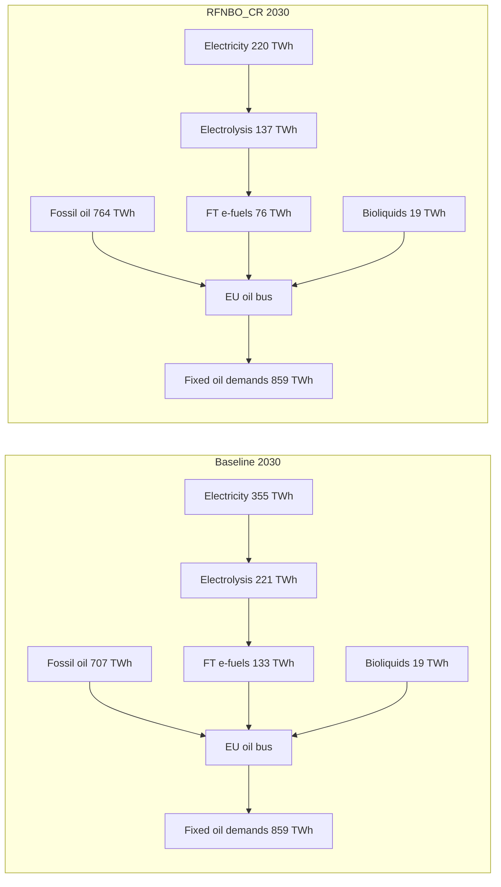

# RFNBO Implementation Review

*Date: 2026-06-10. Scope: RFNBO constraint implementation (`scripts/solve_network.py`),
workflow/config plumbing, and the BE+FR quick-test results
(`results/{baseline,baseline_without_H2,RFNBO_CR}`), cross-checked against the
specification in `main.tex`. Goal: identify everything that should be fixed before the
final full-country, 2-hourly run.*

Severity legend: **CRITICAL** = wrong results or crash; **MAJOR** = materially affects
results or will break variants/full run; **MINOR** = robustness/cosmetic.

---

## 1. Executive summary

The pipeline runs end-to-end and the constraint machinery is wired correctly (all 18
horizon solves optimal, constraints injected per horizon, CO₂ duals transferred). However:

1. **Quick-test discrimination depends on which re-run you look at.** The *first* quick
   test (pre-fix counterfactual, §3.1–3.3) showed RFNBO_CR ≈ baseline (<1 %). After the
   dangling-link fix and constraint cohort corrections (§3.4–3.5), RFNBO_CR **does**
   diverge — e.g. 2030 electrolyser capacity 42 vs 64 GW and sankey “Hydrogen network”
   137 vs 221 TWh (§3.6). Exemption criteria still switch constraints off from 2040 if
   re-enabled without fixing C1/C2.
2. **The grid carbon-intensity used for the exemption criterion is computed wrong**
   (fuel-based CO₂ intensity applied to electric output → emissions underestimated by
   the plant efficiency factor, ~40–60 % for gas, ~60 % for coal).
3. **Several variant scenarios (VAR-A1/A2, global/interconnected) will crash or
   silently misbehave** due to undefined `target_year`/`temporal_year`/`monthly_year`
   variables and incomplete dispatch branches.
4. **The shipped full-run configs are mutually incompatible** (baseline 6H vs RFNBO 3H):
   the cross-scenario file paths will not resolve. For the final run everything must be
   set to `2H` consistently.
5. Known config bugs: Norway 2035 budget typo (`30` instead of `0.30`), cost summaries
   that exclude CO₂-price payments, and the RFNBO-share constraint references
   non-existent carrier names (currently inactive).
6. **Fair-comparison fix (§3.7):** RFNBO scenarios used to *reduce* endogenous H₂/e-fuel
   demand instead of complying (fossil-oil backfill, §3.6). An **endogenous H₂ demand
   floor** now pins each power-to-X pathway to ≥ its baseline level, so RFNBO–baseline
   deltas measure the certification rules at equal e-fuel service. Validated on the full
   quick-test chain: floors bind, cost premium +5.9 → +11.8 bn €/yr (2030 → 2050).

---

## 1b. Status update (2026-06-10, afternoon) — decisions and fixes applied

The MAJOR items were implemented (one local commit per fix, not pushed). Decisions taken:

| Item | Decision |
|------|----------|
| C1/C2/C3 (exemption criteria: CO₂-intensity computation, renewable-share definition, union-vs-intersection) | **Deferred.** `activate_vre_share_criterion` and `activate_carbon_intensity_criterion` are set to `false` in `config/scenarios.quick_test_chain.yaml` (RFNBO_CR), so additionality + temporal correlation apply to **all** countries in all active horizons. `previous_horizon_data` is now only computed when one of the criteria is active, so the buggy `get_vre_share_carbon_intensity()` is not exercised. The function itself is **unchanged** and still carries bugs C1/C2 — it must be fixed before exemptions are re-enabled. |
| C4 (cohort years) | Fixed. `temporal_year` (asset cohort), `target_year` (activation), `monthly_year` are now defined in every scenario branch. For CR/Temp/Add: `temporal_year = 2025` (grandfathering applies to additionality, not temporal correlation — per `main.tex` action point), `target_year = 2030`, `monthly_year = 2025`. The hourly constraint now filters `build_year >= temporal_year`. |
| C5 (monthly at 2025 only) | **Kept as-is and documented**: the delegated act allows monthly correlation until end-2029 and requires hourly from 2030, so with 5-year horizons the monthly constraint applies only at the 2025 horizon and the hourly one from 2030. README/tex wording updated accordingly. |
| C6/C10 (NameError, silent skips) | Fixed: missing `else` added; `logger.error(...); return` replaced by `raise RuntimeError`; vacuous constraints (empty country list) are skipped with a log message. |
| C7 (RFNBO share carriers) | Fixed (`H2 for shipping`, `land transport fuel cell`, Haber-Bosch H₂ port, `vre H2 Electrolysis` production). Flag remains `false`. |
| Norway `'NO': 30` typo | Fixed (`0.30`) in all configs. |
| Full-run `sector_opts` | Unified to `2H` in all seven per-scenario configs (quick test stays 6H). |
| CO₂-payment reporting | Implemented: applied per-country prices are stored in `n.meta["co2_prices"]`; post-solve realized payments in `n.meta["co2_payments"]`; `make_summary.py` adds a `co2 payments` metrics row. |
| Endogenous H₂ demand floor (fair comparison) | **Implemented and validated** (2026-06-10 evening): RFNBO scenarios must consume at least the baseline's H₂ in each endogenous power-to-X pathway, so scenarios are compared at equal e-fuel service. See **§3.7**. |

**On the (non-)bindingness of the temporal-correlation constraint** (user question): the
capacity-based additionality constraint not binding is expected. The hourly constraint
was investigated on the solved 2030/2035 networks — full results in **section 3.3**.
Verdict: **no formulation bug**; the constraint is non-vacuous and does bind at solver
tolerance in ~1–8 % of snapshots, reshaping FR electrolyser dispatch by up to ~11 GW in
individual hours, but it is cheap to satisfy because the eligible additional-VRE pool is
6–19× the electrolyser capacity and electrolysers already operate flexibly
(CF 0.55–0.64, r ≈ 0.7–0.8 with new-VRE dispatch). Whether the pool should be
restricted to a "contracted" subset is an open modelling/policy decision (see 3.3).

---

## 2. Constraint implementation — findings

### 2.1 CRITICAL / MAJOR

#### C1. Grid CO₂ intensity underestimated (exemption criterion) — MAJOR
`get_vre_share_carbon_intensity()` (`scripts/solve_network.py:1624-1723`) multiplies
**electricity output** of conventional links by the `"CO2 intensity"` column of the
costs file, which is in **t/MWh of fuel** (verified: CCGT = 0.198 t/MWh = gas fuel
intensity). The correct electricity-based intensity is `fuel intensity / efficiency`
(CCGT ≈ 0.34, OCGT ≈ 0.48, coal ≈ 0.84 t/MWh_el). Consequence: computed g/MJ values are
far too low, the 18 g/MJ exemption (additionality) triggers too early, and constraints
are deactivated in years where they should still apply.
**Fix:** divide each link's intensity by its electrical efficiency (or compute emissions
from fuel input `p0` instead of electric output `p1`).

#### C2. "Renewable share" definition is questionable — MAJOR
Same function: `H2 Fuel Cell` and `H2 turbine` are counted as renewable generation
(`:1704-1709`). This is circular (H₂ may be non-renewable, and re-electrified RFNBO H₂
inflates the share that then exempts new RFNBO H₂ from constraints). Biomass CHP is
included; hydro/ror are included (the `main.tex` open question — fine, but decide and
document). Storage losses and net imports are ignored. The 90 % flip in 2040 in the
quick test (which switches the constraints off) rests entirely on this definition —
verify it before trusting the switch-off.

#### C3. Exemption combination logic — decision needed — MAJOR (policy)
With both criteria active, the constraint applies to the **union** of non-compliant
sets (`:1802`): a country is constrained if it fails *either* the 90 % VRE share *or*
the 18 g/MJ intensity. Under the delegated act (2023/1184), the low-carbon-grid route
(Art. 4(2)) is an *alternative* compliance path that waives additionality — i.e. the
constraint should arguably apply only if a country fails **both** (intersection).
`main.tex` is ambiguous ("less than 90 % share **or** ... 64.8 g/kWh"). The log message
("not complying with both") contradicts the code. Decide, fix the log, document.
Example impact: France (nuclear-heavy: low intensity, < 90 % RES) is constrained under
union, exempt under intersection.

#### C4. `target_year` / `temporal_year` / `monthly_year` conflation → crashes for variants — MAJOR
Globals set in `__main__` (`:2615-2621`):
- CR/Temp/Add branch sets `target_year=2030`, `monthly_year=2025` but **not**
  `temporal_year` → enabling `global_temporal_correlation`,
  `interconnected_temporal_correlation`, or `global_temporal_correlation_monthly`
  (all use `temporal_year`, e.g. `:2097`, `:2131`, `:2232`) raises `NameError`.
- VAR-A2 / else branch sets only `temporal_year` → `add_temporal_correlation_constraint`
  (uses `target_year`, `:2008`) and the monthly constraint (uses `monthly_year`,
  `:2161`) **crash for VAR-A1/A2** if their temporal flags are on.
Also, `main.tex` specifies that for CR the asset cohort should be `temporal_year=2025`
(grandfathering applies to additionality, not temporal correlation), while the code
filters with `build_year >= 2030`. The hourly and monthly constraints currently use
different cohorts (2030 vs 2025).
**Fix:** define all three variables for every scenario branch; separate "cohort year"
from "activation year"; set the CR cohort per the tex action point.

#### C5. Monthly correlation applied only at the 2025 horizon for CR/Temp — confirm intent — MAJOR
`extra_functionality` (`:2395-2398`): `if investment_year == 2025`. If this encodes
"monthly until 2030, hourly thereafter" (per the delegated act) it is defensible — but
then the README/`main.tex` description ("additionality + temporal + monthly" combined)
is misleading, and the comment `DON'T FORGET TO KEEP IT ON ALSO FOR CR` suggests it was
meant to stay on. Note also that at 2025 the monthly constraint is near-vacuous (only
2025-built assets in the cohort) and its reference network (`baseline_without_H2` 2025)
**still contains H₂ demand** (stripping only runs for `investment_year != 2025`,
`:2642-2644`). Decide and document the intended behaviour.

#### C6. `active_countries` undefined → `NameError` in monthly constraint — MAJOR (latent)
`add_temporal_correlation_monthly_constraint` (`:2199-2218`) has no `else` branch when
`activate_vre_share_criterion` is false. Safe for RFNBO_CR (flag true), crashes for any
variant with monthly on and the criterion off. **Fix:** add the missing `else`.

#### C7. RFNBO demand-share constraint references wrong carriers — MAJOR (currently inactive)
`add_RFNBO_demand_share_constraint` (`:2245-2271`), flag `RFNBO_demand_share: false`:
- `demand_carriers = ["H2 for industry", "shipping hydrogen"]` — the actual load
  carrier is `"H2 for shipping"` (`prepare_sector_network.py:5437`); the
  `"land transport fuel cell"` load is missing.
- `"Haber-Bosch"` is missing from `h2_consuming_carriers`; note its H₂ input is on
  **bus2** (`Link-p2`), so it cannot simply be added to the bus0-based sum.
- H₂ produced by the direct-connection `"vre H2 Electrolysis"` links is not counted as
  RFNBO production (see C8).
Fix before this flag is ever enabled; otherwise the share target applies to a wrong
denominator/numerator.

#### C8. Direct-connection chain (`vre H2 Electrolysis`) is invisible to all RFNBO constraints — document as design decision
`prepare_sector_network.py` adds a dedicated sub-network (carriers `solar vre`,
`onwind vre`, `offwind-* vre`, `vre H2 Electrolysis`, `vre battery *`; `:1844-1929` —
note the `main.tex` "H2 Plant generator" description corresponds to **commented-out
code** `:1931-1973` and is outdated). None of these carriers match the constraint
filters (`carrier == "H2 Electrolysis"`, `carrier.isin(renewable_carriers)`).
This is defensible — a dedicated direct line is inherently RFNBO-compliant — but:
(a) it is an escape route around the constraints once they bind (in the quick test it
was barely used: ≤0.16 MW vs 63–164 GW grid electrolysis, because constraints never
bound); (b) it must be included on the production side of the share constraint (C7);
(c) `main.tex` must be updated to describe the actual implementation, including the
unresolved oversize-factor and cost/efficiency questions raised there.

#### C9. Additionality compares only extendable (current-horizon) assets — document the formulation
`add_additionality_constraint` (`:1745-1782`) sums `p_nom` variables of
`p_nom_extendable` assets on the LHS and `p_nom_opt` of extendable assets in the
baseline on the RHS. In myopic foresight this makes it an **incremental, per-horizon**
constraint (new VRE this horizon ≥ counterfactual new VRE + new electrolysers).
Cumulative additionality then holds only approximately: carried-over stocks and
retirements may differ between the RFNBO and counterfactual runs, and electrolysers
built in earlier horizons (now non-extendable) drop out of the requirement. This is a
defensible design but should be stated explicitly in `main.tex`; the alternative
(totals = fixed `p_nom` constants + extendable variables on both sides) is a small code
change and closer to the literal spec \(C_{vre} \ge C_{vre}^{base} + C_{ely}\).

#### C10. Silent constraint skips — MAJOR (robustness)
All constraint functions do `logger.error(...); return` when the run name doesn't start
with `RFNBO` (`:1736-1740`, `:2003-2007`, `:2152-2156`). A misnamed run would solve
**without any RFNBO constraints** and only leave a log line. **Fix:** `raise` instead.
Same pattern risk: behaviour branches on exact scenario-name strings in ≥10 places
(`solve_network.py`, `rules/common.smk:238-253`, `prepare_sector_network.py:6762`,
`SEPIA/excel_generator.py:44`). Renaming a scenario silently changes physics.

### 2.2 MINOR

- **Hydro in additionality VRE set:** `generator_types` (`:1732-1734`) does *not*
  subtract `hydro` (the tex shows `- {"hydro"}`), and adds
  `"geothermal organic rankine cycle"`. With `renewable_carriers` containing `hydro`,
  reservoir hydro counts toward additionality. Align code, tex and the CLIMACT decision.
- **Snapshot weightings:** the hourly constraint is per-snapshot (no weighting needed),
  but the annual-PPA (`:2068-2070`), monthly (`:2169-2190`) and share (`:2254-2262`)
  sums omit `snapshot_weightings`. With uniform 6H/2H weighting both sides scale
  identically, so the inequalities are unaffected — but add the weights anyway so the
  code survives non-uniform weightings (e.g. time-segmentation).
- **`.filter(like=country)`** (`:1658` etc.) matches substrings of component names.
  Works for BE/FR; for 27 countries prefer mapping `bus → country` to avoid accidental
  matches.
- **`groupby(..., axis=1)`** (`:2026-2027`, `:2187-2188`) is deprecated (removed in
  pandas 3.x) — replace with `.T.groupby(...).sum().T` or xarray grouping.
- **Hard-coded previous-horizon path** (`:1630`):
  `results/{study}/networks/base_s_{clusters}__{sector_opts}_{previous_year}.nc`
  ignores `run.prefix`, assumes empty `opts` wildcard, takes `clusters[0]`/
  `sector_opts[0]` and assumes 5-year horizon spacing (`previous_year =
  investment_year - 5`, `:2614`). Works for the current layouts; brittle. No
  division-by-zero guard on `total_generation`.
- **Performance:** `extra_functionality` reloads the full baseline network once **per
  country** for the CO₂ price (`:2361-2365`) — load it once. The constraint functions
  each re-load `baseline_updated` — cache it.
- **Typos:** config key `co2_budget_nationl` (works because consistent, but rename);
  constraint name `RBNFO_h2_supply_share` (`:2270`); empty-country-list constraints are
  still "added" with a misleading success log (2040–2050 logs).
- **Annual PPA constraint** (`:2080-2085`) is added inside the hourly function but is
  not in `main.tex` — it is implied by the hourly constraint (sum of the hourly
  inequalities), so it is redundant but harmless; document or remove.
- **CO₂ price sign/transfer:** `-mu` of the per-country budget constraint is the
  correct €/tCO₂ (verified convention); the quick test confirms duals are written and
  read. Add a sanity check that `mu` exists and prices are ≥ 0 before applying.

---

## 3. Quick-test results assessment (BE+FR, 2 clusters, 6H)

### 3.1 Headline numbers

| Year | Scenario | Ely (GW) | VRE (GW) | Cost (bn €) | Elec (€/MWh) | H₂ (€/MWh) | Curtail. (%) |
|------|----------|---------|---------|------------|-------------|-----------|--------------|
| 2030 | baseline | 63.6 | 562 | 208.6 | 103.7 | 153.4 | 3.6 |
| 2030 | no-H₂    | 0.0  | 73  | 133.5 | 23.5  | —     | 3.4 |
| 2030 | RFNBO_CR | 63.5 | 561 | 208.4 | 103.6 | 153.5 | 3.3 |
| 2050 | baseline | 164.3 | 1093 | 219.6 | 16.9 | 18.3 | 3.8 |
| 2050 | RFNBO_CR | 164.2 | 1094 | 219.7 | 16.9 | 19.2 | 3.6 |

All 18 solves optimal, no numerical trouble; all horizons present in the CSVs;
`baseline_without_H2` electrolysis is exactly 0 from 2030 (counterfactual works).

### 3.2 Key conclusions

1. **The RFNBO constraints never bind.** RFNBO_CR ≈ baseline within <1 % on
   electrolyser capacity, VRE, fossil generation, CO₂, prices and curtailment.
   Additionality slack is +425 GW (2030) to +881 GW (2045–50): the with-H₂ system
   builds ~560–1100 GW VRE while the no-H₂ counterfactual builds only 49–73 GW, so
   `VRE_RFNBO ≥ VRE_noH2 + Ely` is trivially satisfied. **The quick test therefore
   does not discriminate between RFNBO policy variants.**
2. **From 2040 the constraints are switched off entirely** (logs: empty country lists —
   BE and FR pass the 90 %/18 g criteria). Given C1/C2 above, this switch-off is not
   yet trustworthy.
3. **Reported costs exclude CO₂-price payments.** `metrics.csv` "total costs" is
   capex+opex; the RFNBO_CR 2030 solver objective (372 bn €) is 2.5× the baseline
   objective (150 bn €) because CO₂ payments sit only in the objective. Any cost
   comparison across scenarios must either add the CO₂ bill explicitly to summaries or
   strip it from objectives. Recommended: add a per-country `CO₂ payment` line to the
   summary/SEPIA outputs.
4. **Plausibility flags** (mostly quick-test artifacts, but check before the full run):
   - 73 → 562 GW VRE and 0 → 63.5 GW electrolysers in BE+FR between 2025 and 2030 —
     no build-rate limits are active; consider `max_growth` for credible trajectories.
   - 2050 gas generation spike (~46 TWh vs ~0 in 2045) in both baseline and RFNBO —
     myopic end-horizon artifact; investigate.
   - 2050 price collapse (elec 17 €/MWh, H₂ 18–19 €/MWh vs 122–153 €/MWh in 2045).
   - `no-H₂` electricity price ~23 €/MWh constant 2030–2050 — sanity-check the
     counterfactual's CO₂ pricing actually binds.
5. **What would make the test informative:** force the constraints to bind — e.g. a
   country set with lower VRE quality / higher demand, lower the VRE-share threshold
   temporarily, raise H₂ demand, or fix C1/C2 so the exemptions don't fire. At least
   one quick run where `temporal_correlation` visibly reshapes electrolyser dispatch
   (curtailment up, electrolyser CF down, H₂ price up) should be observed before the
   production run.

### 3.3 Why the temporal-correlation constraint barely moves the optimum (slack analysis)

Post-solve analysis of the (pre-fix) solved 2030/2035 RFNBO_CR networks
(scripts in `/tmp/rfnbo_temporal_constraint_analysis.py`):

- **No formulation bug.** All asset filter sets are non-empty (14–24 new VRE
  generators, 2 geothermal-ORC links, 2–4 electrolysers across BE/FR), countries and
  snapshots align, no NaNs, and the constraint is never violated (min slack ≥ 0).
- **The constraint does bind — but rarely.** Minimum hourly slack is ≈ 0 (solver
  tolerance) in ~1 % of snapshots in 2030 and up to 8 % (BE) in 2035; in the tightest
  FR hours ΔNewVRE = electrolyser load exactly. FR electrolyser dispatch is reshaped
  by up to ~11 GW in individual hours vs baseline, while capacities stay within ±0.2 %.
- **Why it is cheap to satisfy:** (i) the eligible "additional VRE" pool is the entire
  post-cohort fleet difference vs the no-H₂ counterfactual — 67–609 GW, i.e. 6–19×
  electrolyser capacity; (ii) electrolysers already operate flexibly (CF 0.55–0.64,
  correlation with new-VRE dispatch r = 0.66–0.79) because they chase cheap VRE-rich
  hours anyway. If electrolysers were forced to run flat, 23–40 % of snapshots would
  violate matching — so the constraint has teeth in principle; flexibility defuses it.
- **Annual PPA constraint:** 13–78 TWh slack — far from binding.

**Interpretation / decision point:** with the country-level pool formulation, hourly
matching is nearly free whenever the system response to H₂ demand is a large VRE
buildout. This is consistent with the literature on hourly matching with flexible
electrolysis, and is itself a policy-relevant result. If a stricter reading of the
regulation is wanted (PPA portfolio sized to the electrolyser, not the whole national
additional fleet), the LHS pool must be restricted — e.g. introduce dedicated
"contracted VRE" capacity variables per electrolyser country whose size also enters the
additionality constraint. Deferred; to be discussed.

Note for post-processing: extendable capacities must be read from `p_nom_opt`
(`p_nom` is 0 for extendable assets).

### 3.4 CRITICAL bug found after the re-run: free energy from dangling links in the no-H₂ counterfactual

Symptom: `baseline_without_H2` capacities *fall* over the horizons (VRE 73 → 49 GW,
nothing built, flat ~23 €/MWh electricity price) as if there were no demand.

Root cause: `remove_hydrogen_demands()` dropped the H₂/NH₃/methanol **buses** but left
the links that reference them (`H2 turbine`, `H2 Fuel Cell`, `Sabatier`, `SMR CC`,
`H2 pipeline`(+retrofitted)) in the network. PyPSA only logs a consistency *warning*
for links with undefined buses; no nodal balance exists on the missing port, so such a
link becomes a **free energy source/sink**. Verified on the solved 2040 network: 216 GW
of phantom `H2 turbine` produced **584 TWh/yr of free, emission-free electricity** (plus
24 TWh from fuel cells and 195 TWh of free gas from Sabatier), which crowded out all
real investment. The counterfactual — and therefore the RHS of the additionality and
temporal constraints, which compare against it — was meaningless from 2030 on.

Fix (committed): after dropping the buses, remove every link touching a removed bus on
**any** port, plus generators/loads/stores on removed buses. Validated on the broken
2040 network: exactly the 18 dangling links removed, no dangling references left.

Lesson for the full run: treat PyPSA consistency warnings about undefined buses in the
solve logs as errors.

Two further issues surfaced by the same diagnosis (post-solve analysis of the broken
counterfactual networks):

- **District-heat demand double-removal (fixed):** `remove_hydrogen_demands` subtracted
  the baseline waste heat of removed H₂/e-fuel technologies from the urban-central-heat
  *loads* (~70 TWh/yr, FR 83 → 21 TWh at 2040). Removing the supplying links already
  removes the waste-heat supply; end-use demand must stay. The subtraction block was
  removed.
- **Oil-product demand rescaling is a design choice, not a bug (documented):** the
  counterfactual scales oil-product loads by `1 − FT/Σ(oil loads)` (factor ≈ 0.43 at
  2040, land-transport oil −57 %), i.e. the e-fuel share of final demand is *removed*
  rather than substituted by fossil oil. This defines the counterfactual as "without
  RFNBO-related consumption" rather than "RFNBO demand met fossil-only". Keep in mind
  when interpreting counterfactual emissions and CO₂-price interactions.
- Confirmed healthy: CO₂ prices in the counterfactual exactly match the baseline duals
  (€913–1064/t in 2030, falling to €44–96/t in 2050) and non-H₂ electricity demand
  grows as expected (industry 134 → 240 TWh, EV charging 7 → 147 TWh by 2050).

### 3.5 Re-run after all fixes (2026-06-10 afternoon) — the test now discriminates

All 64 steps optimal. Key indicators (GW / bn €):

| Horizon | base VRE | noH₂ VRE | RFNBO VRE | base Ely | RFNBO Ely | base cost | RFNBO cost | RFNBO CO₂ pay |
|---------|---------|----------|-----------|----------|-----------|-----------|------------|----------------|
| 2030 | 562 | **382** | 538 | 63.6 | **42.4** | 208.6 | 197.2 | 236.3 |
| 2035 | 786 | 522 | 811 | 110.6 | 107.3 | 228.1 | 225.7 | 151.8 |
| 2040 | 969 | 607 | 1004 | 145.2 | 155.7 | 242.1 | 244.3 | 62.7 |
| 2045 | 1105 | 671 | 1136 | 164.3 | 184.7 | 238.5 | 242.8 | 15.5 |
| 2050 | 1093 | 659 | 1124 | 164.3 | 184.7 | 219.6 | 225.4 | 1.1 |

Observations:

- The counterfactual now decarbonizes properly (382–671 GW VRE) instead of collapsing,
  and contains no H₂ assets from 2030 on.
- **The RFNBO constraints now visibly shape the solution**: 2030 electrolyser capacity
  drops by a third vs baseline (42 vs 64 GW — the hourly matching against the much
  smaller additional-VRE pool delays electrolysis), while from 2040 RFNBO_CR builds
  *more* electrolyser capacity (156–185 vs 145–164 GW) and more VRE than baseline —
  capacity oversizing to satisfy hour-by-hour matching at lower capacity factors.
- A cost premium emerges in later horizons (e.g. +4.3 bn €/yr in 2045); 2030 capex+opex
  is *lower* than baseline because less electrolysis is built. The H₂ shortfall does
  **not** leave demands unserved — see **§3.6** (fossil-oil backfill into the shared
  oil pool, not SMR).
- `co2 payments` rows are populated for the priced scenarios and decline with the
  CO₂-price trajectory, as expected.

### 3.6 Hydrogen network sankey values and demand fulfilment (2030)

Post-solve analysis of the BE+FR quick-test networks (`base_s_2__6H_2030.nc`) to
explain why the SEPIA sankey shows **221 TWh** of “Hydrogen network” in baseline vs
**137 TWh** in RFNBO_CR, and how identical exogenous demands are still fully met.

#### 3.6.1 What the sankey node actually measures

In `SEPIA/SEPIA_config.xlsx`, the sankey label **“Hydrogen network”** is the secondary
energy node `hyd_se`. It is **not** H₂ pipeline transport (~24 TWh BE↔FR in both
scenarios, ~3.6 GW capacity). For EU 2030, inflow into `hyd_se` is almost entirely
electrolysis (`elc_se → hyd_se`, indicator `prohyd`) and matches PyPSA H₂ electrolyser
output exactly:

| Scenario | Sankey `hyd_se` inflow | PyPSA `H2 Electrolysis` p1 |
|----------|------------------------|----------------------------|
| baseline | 220.8 TWh | 220.8 TWh |
| RFNBO_CR | 136.8 TWh | 136.9 TWh |

**Verdict:** not a SEPIA accounting bug — the node size reflects annual electrolytic H₂
production entering the secondary hydrogen balance, not pipeline throughput.

#### 3.6.2 Why RFNBO_CR produces less hydrogen

Three mechanisms interact at 2030:

1. **RFNBO constraints** (additionality + hourly temporal correlation, active from 2030
   per §1b) raise the effective cost of electrolysis by forcing new electrolysers to
   match dedicated additional VRE rather than cheap grid electricity.
2. **Different CO₂ policy:** baseline uses national CO₂ **budgets**; RFNBO_CR uses CO₂
   **prices** from baseline duals (~900–1,060 €/t for BE/FR in 2030). The optimiser can
   pay for more fossil oil instead of building constrained e-fuel capacity.
3. **Capacity response:** electrolyser capacity falls from **63.6 GW** (baseline) to
   **42.4 GW** (RFNBO_CR); Belgium's local electrolysis collapses (10.6 → 0.7 TWh) while
   France remains the main producer (210 → 136 TWh). Sabatier/methanation drops to zero
   in RFNBO_CR (−7.8 TWh H₂ input).

| H₂ pathway | Baseline | RFNBO_CR | Δ |
|------------|----------|----------|---|
| Electrolysis output | 221 TWh | 137 TWh | −84 TWh |
| Fischer–Tropsch H₂ input | 189 TWh | 107 TWh | −81 TWh |
| Fischer–Tropsch oil output | 133 TWh | 76 TWh | −57 TWh |
| Sabatier H₂ input | 7.8 TWh | 0 TWh | −7.8 TWh |
| Methanolisation / Haber–Bosch | unchanged | unchanged | 0 |

#### 3.6.3 Demands are identical — and fully met

Exogenous `p_set` values are **identical** in both networks. Key EU 2030 demands:

| Demand | Both scenarios |
|--------|----------------|
| Land transport oil | 523.7 TWh |
| Kerosene (aviation) | 100.2 TWh |
| Shipping oil | 89.8 TWh |
| Naphtha (industry) | 134.7 TWh |
| H₂ for shipping | 3.2 TWh |
| Land transport fuel cell | 3.1 TWh |
| Gas for industry | 127.7 TWh |

These are **fixed, inelastic loads** — the optimiser must serve them fully.

**Most transport demand is not met by hydrogen directly.** Large oil-product loads sit
on dedicated oil buses and are supplied via a shared **`EU oil` bus**
(`spatial.oil.nodes` in `prepare_sector_network.py`). Fischer–Tropsch feeds that pool
(H₂ → oil); a separate `oil refining` link supplies fossil oil imports. Land transport
oil is linked from the EU oil bus to the demand bus (`bus0=spatial.oil.nodes`,
`bus1=spatial.oil.land_transport`). Only the small direct-H₂ loads (~6 TWh total) sit on
the H₂ bus.

#### 3.6.4 Substitution mechanism: less e-fuels, more fossil oil

Both scenarios deliver **exactly 859 TWh** of oil products to all oil-based loads. What
changes is the **source mix** into the EU oil bus:

| Source into EU oil bus | Baseline | RFNBO_CR | Change |
|------------------------|----------|----------|--------|
| Fossil oil (`oil refining`) | 707 TWh (82%) | 764 TWh (89%) | **+57 TWh** |
| E-fuels (Fischer–Tropsch) | 133 TWh (15%) | 76 TWh (9%) | **−57 TWh** |
| Bioliquids | 19 TWh (2%) | 19 TWh (2%) | 0 |

The substitution is almost one-for-one: **−57 TWh e-fuels → +57 TWh fossil oil
imports**. Road transport (524 TWh), aviation, shipping, and naphtha are all served at
the same level in both runs.

**Direct H₂ demands (~6 TWh)** are also fully met in both scenarios. RFNBO_CR
redistributes H₂ geographically: France still produces most H₂; Belgium imports more via
the retrofitted H₂ pipeline instead of local electrolysis. Pipeline capacity is unchanged;
only utilisation patterns shift.

#### 3.6.5 Visual summary

#### 3.6.6 Interpretation notes

1. The sankey “Hydrogen network” drop is **real** (less H₂ produced) but mainly affects
   the **e-fuel pathway**, not total energy service to consumers.
2. RFNBO_CR may look **less green on oil products** in this setup: the e-fuel share of
   the oil pool falls from 15 % to 9 %, replaced by fossil imports.
3. The comparison **mixes two policy changes**: RFNBO constraints *and* the switch
   from CO₂ budgets (baseline) to CO₂ prices (RFNBO). To isolate RFNBO effects, run a
   baseline variant with `co2_price_national: true` and RFNBO constraints off.
4. The direct-H₂ demand slice (~6 TWh) is too small to explain the 221 vs 137 TWh
   sankey gap; the difference is almost entirely about **e-fuel supply strategy**.
5. **SEPIA labelling:** consider renaming `hyd_se` from “Hydrogen network” to
   “Hydrogen supply” (or similar) to avoid confusion with H₂ pipeline infrastructure.
   H₂ pipeline transport itself is not currently mapped as a separate sankey flow (only
   compression electricity via `H2 pipeline_2` → `preelchhydcomp`).

### 3.7 Endogenous H₂ demand floor — fair comparison at equal e-fuel service (2026-06-10, evening)

§3.6 showed that the RFNBO–baseline comparison was confounded: under the RFNBO
constraints the optimiser simply produced **less** e-fuel (FT 133 → 76 TWh oil at 2030)
and backfilled the shared oil pool with fossil imports, so the two scenarios delivered a
different *renewable* energy service. The fix implemented here pins the **endogenous**
H₂ demand of the RFNBO scenarios to (at least) the baseline level, so that cost and
system differences measure only the RFNBO certification rules, not a reduced ambition.

#### 3.7.1 Design

New constraint `add_endogenous_H2_demand_floor_constraint` in `scripts/solve_network.py`
(gated by `solving.constraints.endogenous_H2_demand_floor`, active for `RFNBO*` runs
from 2030):

> For each endogenous H₂-consuming link carrier \(c\):
> \[\sum_{\ell \in c}\sum_t w_t \, h_{\ell,t} \;\ge\; D_c^{\text{base}}\]
> where \(h_{\ell,t}\) is the H₂ withdrawn by link \(\ell\) and \(D_c^{\text{base}}\) is
> the annual weighted H₂ consumption of carrier \(c\) in the **solved baseline network
> of the same horizon** (`snakemake.input.baseline_network`).

Deliberate choices (each affects interpretation):

1. **Floor (≥), not equality.** Cannot make the problem infeasible relative to the
   baseline solution and lets RFNBO scenarios *exceed* baseline e-fuel production where
   that is optimal (observed in 2040–2050, see below).
2. **Per carrier, not total H₂.** Preserves the product mix (e-kerosene vs e-methane vs
   e-methanol vs e-ammonia); a total-H₂ floor would allow substituting cheap pathways
   for expensive ones.
3. **EU-level (all modelled nodes), not per country.** The products are delivered into
   EU-wide pools (EU oil/methanol buses) anyway, spatial reallocation of production is a
   legitimate response to the RFNBO rules, and the formulation is robust to any
   `countries` selection.
4. **Structural discovery, not hard-coded carrier lists.** `_find_h2_consuming_link_ports`
   scans all link ports (`bus0…busN`) attached to carrier-`H2` buses and classifies a
   (link, port) as a consumer if port 0 withdraws or port k ≥ 1 has negative
   `efficiency{k}` (Haber-Bosch, electrobiofuels). Links with two H₂ ports (pipelines)
   are excluded structurally. Any **new power-to-fuel technology** added to
   `prepare_sector_network.py` is therefore picked up automatically.
5. **Exclusions** (configurable via `solving.constraints.endogenous_H2_demand_floor_exclude`,
   default in code): `H2 Fuel Cell`, `H2 turbine` (re-electrification is power-system
   *flexibility*, not fuel demand) and `H2 liquefaction` (throughput fixed by the
   identical exogenous shipping load).
6. **Reference values from actual baseline dispatch** (`links_t.p{k}` ×
   `snapshot_weightings.generators`), robust to time-varying efficiencies; carriers with
   < 1 MWh baseline consumption are skipped with a log line; a carrier present in the
   baseline but absent from the RFNBO network raises `RuntimeError` (no silent skip,
   consistent with the C10 policy).

Config plumbing: flag `endogenous_H2_demand_floor` added next to the other RFNBO flags —
`true` in all `config.RFNBO_*.yaml` and for `RFNBO_CR` in
`scenarios.quick_test_chain.yaml`; `false` for both baselines and in the quick-test base
config.

#### 3.7.2 Validation (full quick-test chain re-run, all 6 horizons optimal)

Floors injected per horizon (TWh H₂, from solved baseline dispatch; values verified
offline against §3.6 before the run — FT 188.75 ≈ the 189 reported there):

| Horizon | Fischer-Tropsch | Haber-Bosch | Sabatier | methanolisation |
|---------|-----------------|-------------|----------|-----------------|
| 2030 | 188.7 | 9.3 | 7.8 | 8.5 |
| 2035 | 336.6 | 9.3 | 7.9 | 17.5 |
| 2040 | 444.9 | 9.3 | 6.9 | 27.5 |
| 2045 | 483.8 | 9.3 | 4.5 | 38.5 |
| 2050 | 329.4 | 9.3 | 32.6 | 48.5 |

Achieved RFNBO_CR consumption: **at the floor (binding)** for almost all carrier/years;
above it where the optimiser wants more e-fuel — FT +28 TWh (2040), +42 TWh (2045),
Sabatier +61 TWh (2050). No violations (max numerical slack −0.05 TWh). Additionality
and temporal-correlation constraints remain active alongside the floor; exogenous loads
verified identical across scenarios.

Headline 2030 comparison (was §3.6, now with the floor):

| Indicator (2030) | baseline | RFNBO_CR pre-floor | RFNBO_CR **with floor** |
|------------------|----------|--------------------|--------------------------|
| Electrolysis output (TWh) | 220.8 | 136.9 | **225.0** |
| FT H₂ input (TWh) | 188.7 | 107 | **188.7** |
| Fossil oil into EU oil bus (TWh) | 706.6 | 764 | **706.4** |
| FT e-fuel into EU oil bus (TWh) | 132.9 | 76 | **132.9** |
| Electrolyser capacity (GW) | 63.6 | 42.4 | **69.7** |
| capex+opex (bn €) | 208.6 | 197.2 | **214.5** |

The oil-pool substitution artefact of §3.6.4 is gone: both scenarios now deliver the
same e-fuel volumes, and RFNBO_CR needs **+6.1 GW** of electrolysers (oversizing for
hourly matching, CF down) plus ~76 GW more VRE (645 vs 569 GW) to do so.

**The policy-relevant cost premium of the RFNBO rules at equal e-fuel service**
(capex+opex delta vs baseline; CO₂ payments are transfers and excluded):

| Horizon | 2030 | 2035 | 2040 | 2045 | 2050 |
|---------|------|------|------|------|------|
| Δ cost RFNBO_CR − baseline (bn €/yr) | **+5.9** | +7.2 | +10.2 | +10.8 | +11.8 |
| Electrolyser capacity (GW) RFNBO vs base | 69.7 / 63.6 | 121.1 / 110.6 | 166.4 / 145.2 | 191.5 / 164.3 | 191.5 / 164.3 |

Before the floor, the 2030 "premium" was **negative** (−11.4 bn €) because RFNBO_CR
simply did less — exactly the unfair comparison this constraint removes.

#### 3.7.3 Interpretation notes and caveats

1. **Spatial reallocation is real and now visible cleanly:** at 2030, BE electrolysis
   collapses (10.6 → 1.3 TWh) and FR expands (210 → 224 TWh) at identical total
   service — a genuine RFNBO-rules effect, not a demand artefact.
2. **Re-electrification rises** (H₂ Fuel Cell 0.2 → 4.4 TWh at 2030). It is excluded
   from the floor LHS, so it cannot be used to satisfy the floor; it reflects H₂ being
   used as flexibility under hourly matching. Keep excluded.
3. The comparison still **mixes CO₂ budgets (baseline) vs CO₂ prices (RFNBO)** —
   §3.6.6 point 3 still applies; the floor removes the demand confounder only.
4. The floor requires the **baseline solved at identical wildcards** — already a hard
   workflow dependency (CO₂ prices), so no new ordering constraint.
5. With exemption criteria later re-enabled (C1–C3), the floor stays active regardless —
   it conditions only on the scenario being `RFNBO*` and the horizon ≥ 2030. Decide
   whether an exempted country-set scenario should also keep the floor (currently: yes,
   EU-level, so unaffected by per-country exemptions).
6. During implementation a classification bug was caught in review (`.lt(0).index`
   returned *all* candidates instead of the negative-efficiency subset, which would have
   classified H₂-*producing* ports as consumers); fixed before any run. The discovery
   was validated offline against solved baselines (2030/2050): exactly
   {FT, Sabatier, methanolisation, Haber-Bosch} found, all myopic build-year instances
   included, no producers/pipelines/excluded carriers matched.

---

## 4. Workflow / configuration for the final run (all countries, 2H)

### 4.1 Blockers

1. **Unify `sector_opts` to `2H` in all seven scenario configs**
   (`config.baseline.yaml`, `config.baseline_without_H2.yaml`, `config.RFNBO_*.yaml`).
   Cross-scenario inputs (`rules/common.smk:238-253`) and the hourly temporal
   constraint (`generators_t.p.loc[sns]`) require the baseline networks to exist at the
   **same** `{clusters}_{opts}_{sector_opts}` as the consuming run. The shipped configs
   (baseline 6H, RFNBO_CR/Temp/Add 3H) are mutually incompatible.
2. **Norway 2035 budget typo:** `'NO': 30` → `0.30` in `config.baseline.yaml:139`,
   `config.quick_test_chain.yaml:116` (and any other config carrying the block). As
   shipped, NO has a non-binding 2035 cap → zero CO₂ shadow price exported to all RFNBO
   scenarios for Norway.
3. **Run order is manual with per-scenario Snakefiles:** baseline → baseline_without_H2
   → RFNBO variants; the RFNBO Snakefiles cannot build the baseline inputs themselves.
   Verify all six horizons of both baselines exist (at 2H, 33 clusters) before starting
   any RFNBO run. Alternatively extend the `Snakefile_quick_test_chain` pattern to the
   full model (single DAG, shared preprocessing — also ~3× cheaper on preprocessing).
4. **Fix C4 and C6 before launching VAR-A1/VAR-A2** (they currently crash), and decide
   C3/C5 before launching anything, since they change which constraints are active.

### 4.2 Consistency decisions

- **Counterfactual design:** the quick test strips H₂ at solve time
  (`remove_hydrogen_demands`), the full `config.baseline_without_H2.yaml` *also*
  disables H₂ infrastructure at prepare time (`H2_network: false`, etc.). Pick one
  design and make sure the quick test validates the one you will use in production.
- **`baseline_without_H2` CO₂ policy** is prices-from-baseline-duals (not budgets) —
  intentional, but document it, since the README shorthand suggests "budgets".
- 2025 has no national CO₂ budget and no CO₂ price in any scenario
  (`investment_year != 2025` guards) — confirm this is intended.

### 4.3 Operational

- **Memory:** 2H = 4380 snapshots/yr (3× the 6H quick test). 128 GB `mem_mb` may be
  tight at 33 clusters; do one 2H smoke test (one horizon) and check
  `*_memory.log` before queueing everything.
- **2050 numerics:** baseline 2050 previously hit Gurobi numerical trouble; keep
  `gurobi-numeric-focus` as fallback, and remember `remove_hydrogen_demands` silently
  degrades if baseline dispatch is missing (README caveat).
- **linopy pin:** keep `linopy = 0.6.1` (README known issue).
- **Pre-flight:** `snakemake -n` on one RFNBO 2030 target and inspect the resolved
  `baseline_network` / `baseline_updated` input paths.

---

## 5. Prioritized action list

| # | Action | Severity | Ref |
|---|--------|----------|-----|
| 1 | Fix grid CO₂-intensity computation (divide by efficiency / use fuel input) | CRITICAL for exemptions | §2 C1 |(Done)
| 2 | Unify `sector_opts: 2H` across all configs; verify cross-scenario paths | CRITICAL for full run | §4.1 |
| 3 | Define `target_year`/`temporal_year`/`monthly_year` for every variant; CR cohort per tex (2025) | MAJOR | §2 C4 |
| 4 | Decide union vs intersection for the two exemption criteria; fix log text | MAJOR (policy) | §2 C3 | (Done)
| 5 | Decide monthly-correlation activation (2025-only vs always) and align README/tex | MAJOR | §2 C5 |
| 6 | Review renewable-share definition (H2 FC/turbine, hydro) | MAJOR | §2 C2 |(Done)
| 7 | Fix `'NO': 30` budget typo | MAJOR | §4.1 |
| 8 | Add missing `else` in monthly constraint; replace silent skips with raises | MAJOR | §2 C6/C10 |
| 9 | Fix RFNBO-share carriers (`H2 for shipping`, Haber-Bosch bus2, vre electrolysers) before enabling | MAJOR | §2 C7 |
| 10 | Add CO₂-payment line to cost summaries for cross-scenario comparability | MAJOR (reporting) | §3.2-3 |
| 11 | Run one quick test where constraints actually bind (validation of the mechanism) | MAJOR (validation) | §3.2–3.6 |
| 12 | Update `main.tex` (direct-connection implementation, incremental additionality, annual PPA, hydro decision) | MINOR (docs) | §2 C8/C9 |
| 13 | Hardening: snapshot weights in sums, bus→country mapping, `groupby(axis=1)`, cached network loads, typos | MINOR | §2.2 |
| 14 | Consider `max_growth` limits for credible deployment trajectories | suggestion | §3.2-4 |
| 15 | ~~Impose baseline endogenous H₂ demand on RFNBO scenarios (fair comparison)~~ **done** | MAJOR (methodology) | §3.7 |
